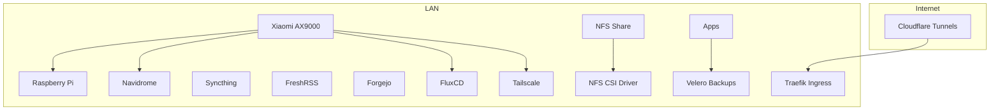
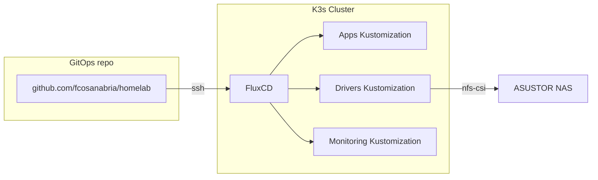

Considero genuinamente que tener un homelab, es la manera perfecta para poder aprender sobre tecnologia de infraestructura de manera practica, y esto por defecto provee muchas ventajas. Si nunca ha escuchado el termino, pues es el concepto de correr servers desde tu casa. Y bueno, un server es una computadora que correr 24/7 el cual se tiene conectado a un red, y la mayoria de las veces, este no tiene ningun tipo de interfaz grafica comun del sistema operativo en cuestion.

Me gustaria comentarles en una eventualidad cuales son las ventajas de tener un homelab, y todas sus ventajas, pero mantegamos eso al margen. En este espacio les quiero comentar como se encuentra disenado mi homelab.

## Hardware

Este es el hardware que tengo en este momento.

| Equipo                  | Especificaciones          | Rol                                                                                                                       |
| ----------------------- | ------------------------- | ------------------------------------------------------------------------------------------------------------------------- |
| Lenovo ThinkCentre M700 | Ubuntu 24.04.4 LTS, AMD64 | **Single-node K3s cluster** (`main-node`, `192.168.31.116`) (Tengo dos, pero por el mommento solo estoy corriendo un NUC) |
| ASUSTOR NAS AS5402T     | 16 TB                     | Storage + servicios de infraestructura ( backups, música, repos, fotos )                                                  |
| Raspberry Pi            | N/A                       | Trilium Notes                                                                                                             |

---

## Arquitectura general

Al final, todo depende de mi Router, el cual estoy usando un Xiaomi AX9000. Estoy contenplando en cambiarlo por otro router que tengo que hace poco me compre para experimentar, un Netgear Nighthawk AX6.



---

## El cluster: K3s

Uso **K3s** en un solo nodo. No es HA, pero para un homelab personal es más que suficiente. Lleva ~600 días prendido y con workflows encima y nunca me ha dejado tirado.

| Propiedad    | Valor                          |
| ------------ | ------------------------------ |
| Distribución | **K3s v1.30.6+k3s1**           |
| OS           | Ubuntu 24.04.4 LTS             |
| Kernel       | `6.8.0-107-generic`            |
| Nodo         | `main-node` (`192.168.31.116`) |
| CRI          | containerd `1.7.22-k3s1`       |
| GitOps       | **FluxCD** v2.4.0              |
| Ingress      | **Traefik** (bundled con K3s)  |
| Secrets      | **SOPS** + **Age**             |



Cuando estuve usando el segundo nodo, este lo usaba con Talos, el cual me gustaba muchisimo usarlo. Pero tener dos nodos, me parecia un poco innecesario, entonces lo tenia apagado la mayoria de las veces, hasta que decidi quitarlo de la rotacion nada mas. El plan a corto plazo es migrar el nodo que tengo con K3S a Talos Linux.

Una de las cosas que me gusta con respecto al menejo de los secretos usando SOPS y AGE, es que FluxCD por diseno es compatible con el uso de los secretos de esta manera. Y la verdad es que es bastante facil usar los secretos asi; ya que no tengo que depender de ningun secret manager para poder transportar mis secretos. Por que los puedo tener en GitHub, y no me importa, por que estan encriptados, solamente el cluster tiene el secreto para desencriptar. De nuevo, es lo que me sirve, y me parece efectivo. En algun momento donde logre tener mas infraestructura en casa, puedo empezar a implementar algun secret manager.

### Storage

K3s trae `local-path-provisioner` por defecto, pero mis apps necesitan persistencia compartida y respaldable. Para eso uso **NFS CSI Driver v4.9.0** que monta un share del NAS ASUSTOR:

```yaml
storageClassName: nfs-csi
parameters:
  server: 192.168.31.7
  share: /volume1/Public
  mountOptions:
    - hard
    - nfsvers=4
```

> **Nota:** El NAS está en `192.168.31.7` y el cluster en `.116`. Ambos están en la misma LAN detrás del router Xiaomi.

### Exposición a internet

No abro puertos, por eso una de las cosas que mas me gustaba de Talos Linux, era que ni siquiera el puerto SSH estaba abierto, pero bueno ese es otro tema. Aqui todo entra por Cloudflare Tunnels. Cada app que quiero exponer tiene su propio `cloudflared` deployment dentro de su namespace, apuntando a un hostname como `fit.fcosanabria.com`, `habits.fcosanabria.com`, etc.

> Por ahora no uso Tailscale en el cluster. Cloudflare cubre todo lo que necesito.

### Aplicaciones en el cluster

| App                                                       | Tipo | Para qué                                                                                          |
| --------------------------------------------------------- | ---- | ------------------------------------------------------------------------------------------------- |
| [Homepage](https://gethomepage.dev/)                      | Helm | Dashboard central                                                                                 |
| [Immich](https://immich.app/)                             | Helm | Fotos (alternativa a Google Photos) - pero lo tengo sin funcinar ahora, por que lo uso en el NAS. |
| [Trilium Notes](https://github.com/zadam/trilium)         | Helm | Notas. Estoy migrando mis notas de Siyuan.                                                        |
| [wger](https://wger.de/)                                  | Helm | Workout / fitness tracker                                                                         |
| [Linkding](https://github.com/sissbruecker/linkding)      | Raw  | Bookmarks                                                                                         |
| [Memos](https://usememos.com/)                            | Raw  | Notas rápidas, ideas, etc.                                                                        |
| [Beaver Habits](https://github.com/daya0576/beaverhabits) | Raw  | Hábitos                                                                                           |
| [Traggo](https://traggo.net/)                             | Raw  | Time tracking                                                                                     |
| [Wallabag](https://wallabag.org/)                         | Raw  | Read-it-later                                                                                     |
| [Baikal](https://sabre.io/baikal/)                        | Raw  | CalDAV / CardDAV                                                                                  |
| [n8n](https://n8n.io/)                                    | Raw  | Automatización / workflows                                                                        |

Tengo que admitir que una de las mejores decisiones que hice, fue dejar de depender de servicios en la nube para manejar mi calendario y mis contactos. Lo hice relativamente hace poco, y me arrepiendo de no haberlo hecho antes. Ya no depende de Google Calendar o iCloud para el manejo de esas cosas. Ahora, puedo usar CalDAV en cualquier lado, con cualquier aplicacion que quiera, sabiendo que esa informacion solo se encuentra en mi control.

## El NAS: ASUSTOR AS5402T

El NAS no es solo storage. También corre servicios que no necesitan estar en Kubernetes:

| Servicio          | Para que                                                            |
| ----------------- | ------------------------------------------------------------------- |
| **Velero**        | Backups de los volúmenes del cluster (snapshots a un share de 16TB) |
| **Navidrome**     | Streaming de mi biblioteca musical                                  |
| **Syncthing**     | Sincronización de archivos entre dispositivos                       |
| **FreshRSS**      | Agregador de feeds (noticias, blogs)                                |
| **Forgejo**       | Mirror / backup de mis repositorios de GitHub                       |
| **Tailscale**     | VPN para acceso remoto al NAS y LAN                                 |
| **Photo Gallery** | Respaldo de fotos de los celulares de la familia                    |

> El NAS vive fuera del cluster. Tailscale me permite llegar a la LAN y al NAS sin abrir puertos. En el cluster, Cloudflare Tunnels hacen el mismo trabajo para las apps públicas. Me gusta pensar que el NAS lo tengo para backup y para cosas que no me interesan tener en el internet.

## Backups con Velero

<!-- TODO: explicar tu estrategia de backup: frecuencia, qué volúmenes respaldas, dónde se almacenan en el NAS, y si tienes algún offsite -->

Uso Velero para hacer snapshots de los PVCs del cluster. Los backups se almacenan en el NAS. Esto me permite recuperar el estado de cualquier app si se rompe el cluster o si necesito migrar. Lo que he estado tratando de hacer, incluso para mi propio aprendizaje es hacer que las apps use postgre si es posible y mantener una copia de las bases de datos en el NAS y despues en la nube. Esto con el fin de poder sacar metricas interesantes para mi instancia de Grafana.

## Red y DNS

- **Router principal:** Xiaomi AX9000 (`192.168.31.1`)
- **Router ISP:** OEM dado por el vendor (`192.168.1.1`) - en modo bridge

## ¿Qué sigue?

<!-- TODO: lista de pendientes o mejoras que quieras hacer al homelab -->

- [ ] Especificar el rol de la Raspberry Pi
- [ ] Documentar la estrategia de Velere con más detalle
- [ ] Considerar si en algún momento agregar un segundo nodo al cluster
- [ ] Evaluar si Tailscale dentro de K8s tiene algún caso de uso futuro

> _Última actualización: {{ page.updated }}_
