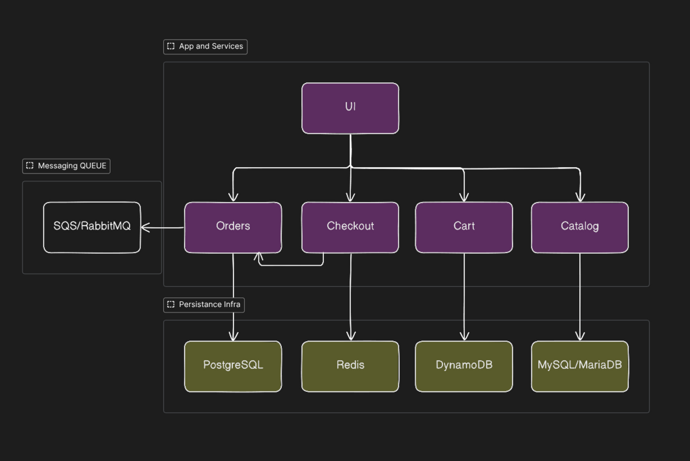
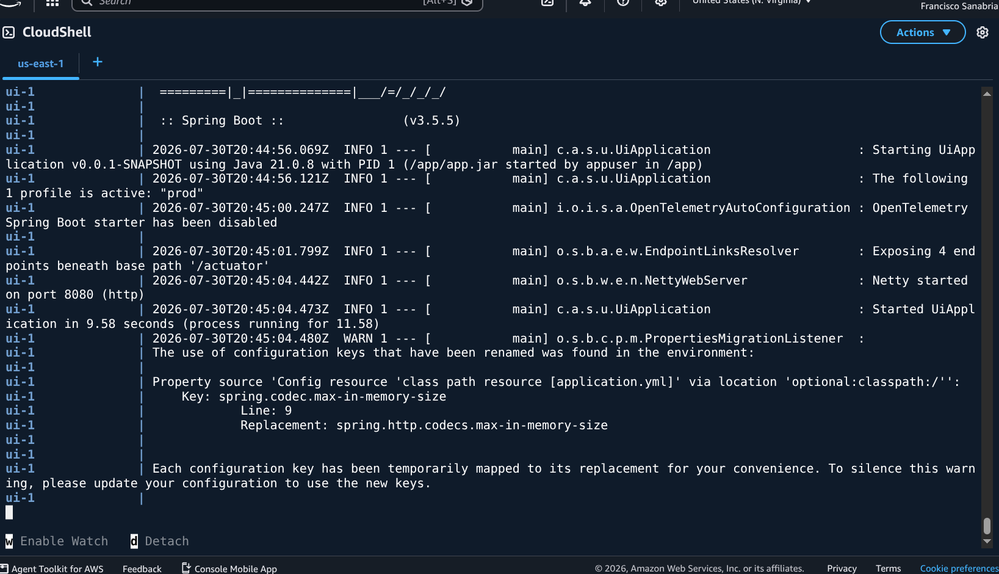
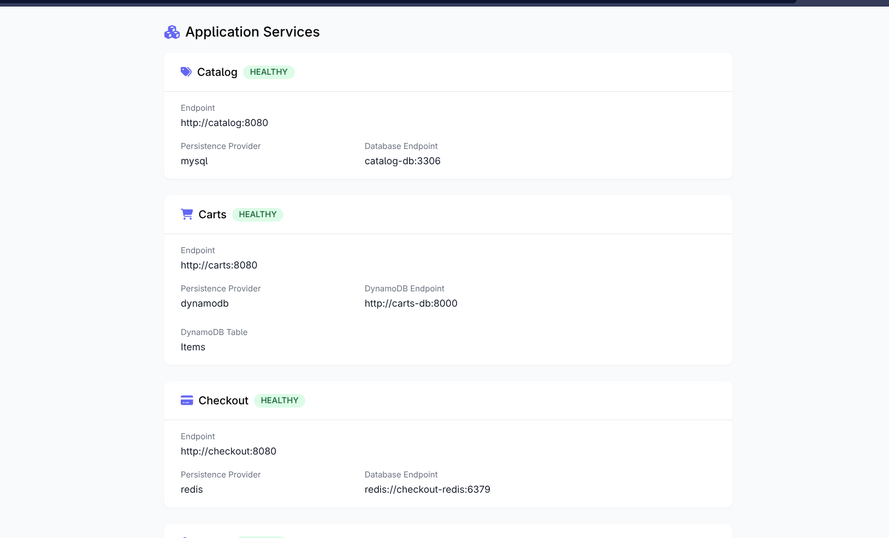

# omg, AWS?

Nunca me imaginé que llegaría a este punto, pero aquí estoy, escribiendo sobre mi primer proyecto de DevOps en AWS. Después de que echaran de mi trabajo en la empresa donde trabajaba, seguía pensando en que Azure era la mejor opción para mi carrera profesional, puesto ahi hice la mayoría de mi carrera profesional, pero después de investigar un poco más, me di cuenta de que AWS es la plataforma de nube más utilizada en la industria Costarricense y Latinoamericana. No me arrepiento de mi decisión, puesto que Azure me encanta y me dio muchas oportunidades dentro de mi gremio. Por lo tanto, decidí que era hora de "aprender" y trabajar con AWS. Lo pongo entre comillas por qué al final del día, no es que no sepa nada de AWS, sino que nunca había tenido la oportunidad de trabajar con esta plataforma en un entorno profesional. Los conceptos siempre son los mismos, pero la implementación y la forma de trabajar con cada plataforma es diferente.

*Work in progress...*

Primero, una de las cosas que debo de hacer, es, pues el diseño de la arquitectura de la infraestructura. He tenido varias ideas, las cuales he podido confirmar usando distintos esquemas ya existentes en la misma plataforma de AWS y Azure. Por lo tanto, he decidido que la mejor opción es usar un esquema de arquitectura de microservicios, el cual me permitirá tener una infraestructura más escalable y flexible.

Además, he querido usar la implementación de una aplicación ya lista, la cual me permitirá tener una base para poder trabajar y aprender más sobre la plataforma de AWS. Esta app es de Stacksimplify. Que son un grupo de desarrolladores que se dedican a crear aplicaciones y soluciones en la nube, y que tienen un repositorio en GitHub con una aplicación lista para ser desplegada en cualquier plataforma en la nube. Ya esto por defecto me ahorra un montón de tiempo.

Veamos más o menos como se ve la arquitectura que quiero implementar:




# Parte 1

Usando Docker Compose para el POC.

Ahora llega el momento de probar el POC. Para este momento tengo una maquina virtual en AWS que es relativamente sencilla, apenas para verificar que todo funciona correctamente. Esta VM es una instancia de EC2, y que estoy interactuando directamente desde el AWS CloudShell. Meramente por motivos de rapidez.


A continuacion lo que hice fue aseguararme de instalar Docker y Docker Compose. Por la naturaleza de la maquina en la que me encuentro tengo que descargar el binario y colocarlo en el path de Docker. 

```bash
# Create the CLI plugin directory
sudo mkdir -p /usr/local/lib/docker/cli-plugins

# Download the latest Docker Compose v2 binary (always pulls the newest release)
wget https://github.com/docker/compose/releases/latest/download/docker-compose-linux-x86_64 -O docker-compose

# Make it executable
chmod +x docker-compose

# Move it to the CLI plugins directory
sudo mv docker-compose /usr/local/lib/docker/cli-plugins/docker-compose

# Verify install
docker compose version
```

Y ahora con Docker Compose instalado, ya podemos descargar el file con los contenedores que vamos a usar para nuestro proyecto. Y a construirlos.

```bash
# Descargamos el compose file
wget https://github.com/aws-containers/retail-store-sample-app/releases/download/v1.3.0/docker-compose.yaml

# Set environment variable
export DB_PASSWORD='yourpassword'

# Start all services
## Important Note:  if your file name is docker-compose.yaml dont need to specify -f with file so you can use any of the commands depending on the name.
docker compose -f docker-compose.yaml up
docker compose up

# OR start in detached mode (background)
docker compose -f docker-compose.yaml up -d
docker compose up -d

# Stop all services (gracefully) (NOT NEEDED NOW - JUST FOR REFERENCE)
docker compose down
```

> Como les habia comentado hace un rato, este Docker Compose file viene de una solucion ya dada por Stacksimplify.
> Esto significa que no es una aplicacion que yo haya creado, sino que es una solucion que ya existe y que yo simplemente la voy a usar para mi proyecto. Esto facilita mucho el trabajo de diseno de la infraestructura.

Una vez los contendores se encuentren arriba, podemos visitar la IP publica de nuestra instancia de EC2 con el numero de puerto correspondiente: 



```bash
http://<EC2-Instance-Public-IP>:8888
http://<EC2-Instance-Public-IP>:8888/topology
```

Asi se deberia de ver, por ejemplo:



Si fuese el caso de que quisieramos correr comando dentro del contenedor, como para hacer troubleshooting o similar, podemos iniciar el shell session usando:

```bash
# connect to the container, in this case the UI one.
docker exec ui sh

curl http://localhost:8080
curl http://localhost:8080/topology
curl http://localhost:8080/actuator/health
exit
```

Y para limpiar nuestros contenedores usamos `docker compose down`.

Hay varios otros comandos que podemos usar usando Docker, pero se encuentra fuera del scope de este apartado.

Adjunto el repositorio de aplicacion: https://github.com/aws-containers/retail-store-sample-app/